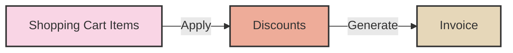

# Cash register

A simple cash register application

It supports a shopping cart where you add elements and you can have different [discounts](src/models/discounts/) applied.

The basic workflow is that you have a shopping cart where you add items, then the invoice calculator will apply all the discounts and generate a proper invoice. In the UI we will display both the shopping cart and the invoice.

## Usage

Install dependencies with `bundle install`.

You can run the application with `make run` or `bundle exec ruby src/ui/cli.rb`.

## Development

There are a couple of tasks in a makefile to help with development:

- `make watch` - Runs the tests on every file change. It requires `entr` and `ag` to be installed.
- `make console` - Starts a Irb console with the application loaded.

